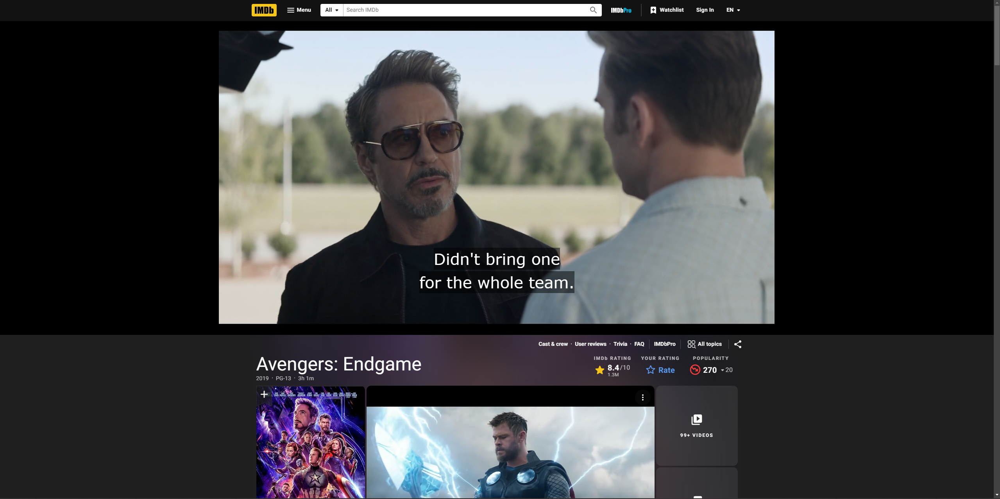

# IMDB Video Player - Stream from Vidsrc

A **Tampermoney/Greasemonkey** usescript that embeds a streaming video player from [vidsrc](https://vidsrc.cc) directly into IMDb movie and series pages, allowing you to watch videos without leaving the IMDb website.

# Features:

- **Seamless Streaming:** Adds a video player directly into IMDb movie/series pages from `vidsrc`
- **Automatic Detection:** Detects whether the page is for a movie or a TV series and loads the correct player.
- **Supports IMDb and TMDb:** Uses IMDb ID and TMDb's API to fetch the corresponding video source.
- **Cross-Origin Requests:** Leverages Greasemonkey/Tampermonkey's `GM_xmlhttpRequest` for cross-domain API calls.

# Preview

# Installation:

To install the userscript:
1. Install **Tampermonkey** or **Greasemonkey** extension in your browser:
> - [Tampermonkey for Chrome](https://chromewebstore.google.com/detail/tampermonkey/dhdgffkkebhmkfjojejmpbldmpobfkfo)
> - [Tampermonkey for Firefox](https://addons.mozilla.org/en-US/firefox/addon/tampermonkey/)
> - [Greasemonkey for Firefox](https://addons.mozilla.org/en-US/firefox/addon/greasemonkey/)
2. Install the script by visiting the link below:
> - [IMDB Video Player - Stream from Vidsrc](https://greasyfork.org/en/scripts/513145-imdb-video-player)
3. Click the "Install this script" button in your Greasemonkey/Tampermonkey dashboard.

# How it works

- **Movies**: Automatically embeds a video player using the movie's IMDb ID.
- **Series**: Fetches the series' TMDb ID using the IMDb ID, then embeds the corresponding video player for the TV show.
- The script detects the page type (Movies or Series) based on the IMDb page's title.

# How to Use

1. Navigate to any IMDb movie or TV series page.
2. The script will automatically insert the video player at the top of the page.
3. Enjoy the streaming experience directly on IMDb!

# Example URLs

- **Movies:** [Avengers Endgame](https://www.imdb.com/title/tt4154796/)
- **TV series:** [Stranger Things](https://www.imdb.com/title/tt4574334/)

# Supported Sites

- `imdb.com`
- `m.imdb.com`
- **Video Source:** `vidsrc.cc`

# API Integration

This script uses the following external APIs:
- [TMDb (The Movie Database)](https://themoviedb.org): For fetching series IDs based on IMDb IDs.
- [vidsrc](https://vidsrc.cc)

# Technical Details
## Dependencies

- **Greasemonkey/Tampermonkey:** Required to run the script in your browser.
- **GM_xmlhttpRequest:** Used to make cross-origin requests to fetch TMDb data.

## Main Components

1. **IMDb ID extraction:** The script extracts the IMDb ID from the URL to determine the video source.
2. **TMDb API Query:** For TV series, the script queries TMDb to get the corresponding series ID using the IMDb ID.
3. **Iframe Embedding:** A video player iframe from `vidsrc` is embedded based on the IMDb or TMDb ID.

## Error Handling

- Gracefully handles network errors and missing TMDb data, logging relevant messages to the console.
- If the target DOM element is missing, the script logs an error without breaking the page.